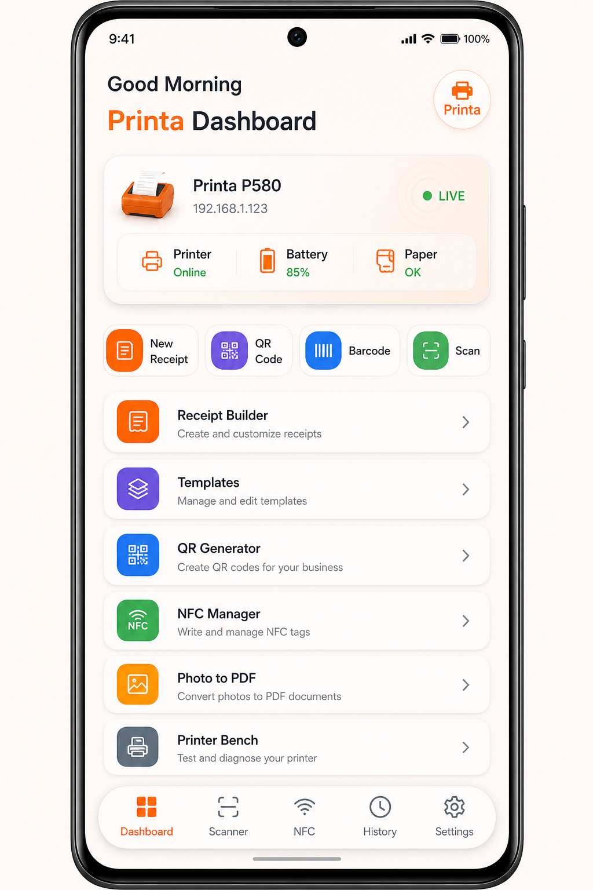
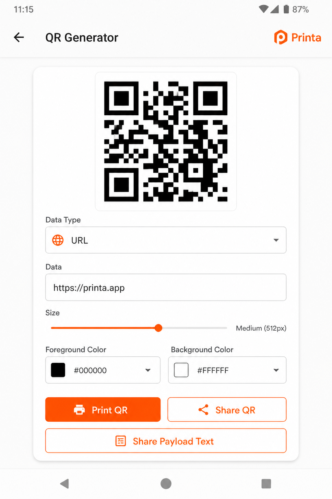
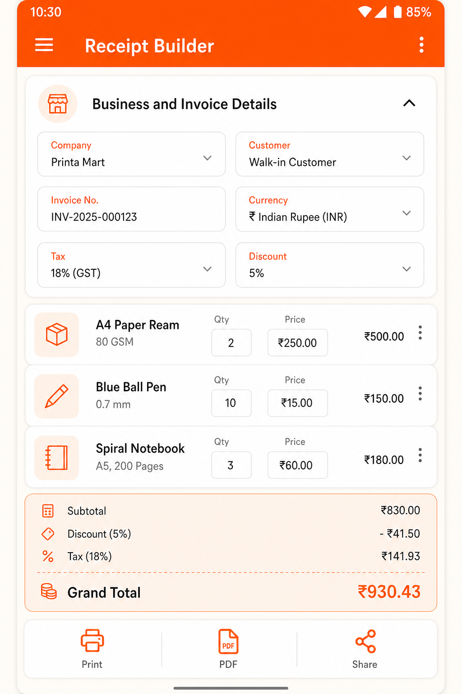
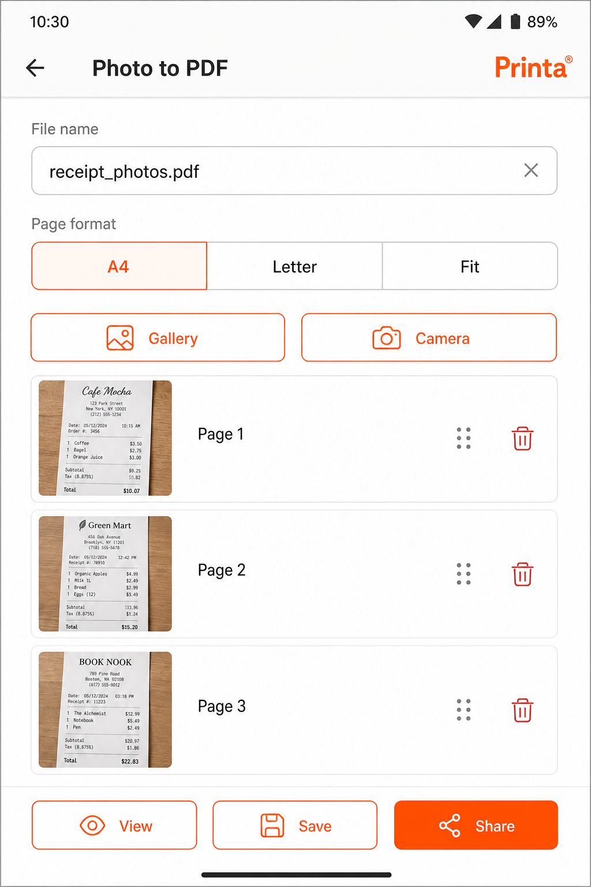

# Printa

<p align="center">
  
</p>

<p align="center">
  <strong>Receipt printing, QR/barcode, NFC, and PDF tools for handheld POS &amp; thermal printers.</strong><br/>
  Built with Flutter · Material 3 · Offline-first Hive · Sunmi printer MethodChannels
</p>

<p align="center">
  Developed by <strong>Fahad Ali</strong>, Senior Mobile App Consultant
</p>

---

## Screenshots

| Dashboard | QR Generator |
|:---------:|:------------:|
|  |  |

| Receipt Builder | Photo to PDF |
|:---------------:|:------------:|
|  |  |

---

## Highlights

- **Personalized dashboard** — greeting, live device status, quick actions, module grid
- **Receipt Builder** — tax/discount, line items, live totals, thermal print + PDF share
- **Templates** — 8 presets, edit & persist in Hive, share as PNG/PDF
- **QR & Barcode** — multiple formats, validation, print & share (QR image share)
- **Scanner** — hardware laser (POS) + camera fallback
- **NFC Manager** — read / write / update / erase NDEF tags
- **Photo to PDF** — multi-photo pick, reorder, rename, view, share
- **History & Settings** — Hive logs + business prefs (theme, tax, paper width)
- **Floating pill nav** — Dashboard · Scanner · NFC · History · Settings
- **Printa orange** Material 3 light/dark themes

---

## Features & Modules

| Module | Description |
|--------|-------------|
| **Dashboard** | Home, hardware status, quick actions, module grid |
| **Receipt Builder** | Build & print receipts; PDF share |
| **Templates** | 8 presets; edit, save, share PNG/PDF |
| **QR Generator** | Text, URL, WiFi, vCard, UPI, and more — print & share image |
| **Barcode Generator** | Code128, Code39, EAN13, EAN8, UPC-A, PDF417, Data Matrix |
| **Scanner** | Laser MethodChannel + `mobile_scanner` camera |
| **NFC Manager** | Read / write / update / erase + UID & tech info |
| **Photo to PDF** | Gallery/camera, reorder pages, rename, view, share |
| **Printer Bench** | Alignment, styles, tables, feed, cut, status tests |
| **History** | Searchable Hive log (receipts, scans, QR, NFC, PDFs) |
| **Device Info & Settings** | Diagnostics and global preferences |

---

## Technology Stack

| Area | Choice |
|------|--------|
| Framework | Flutter (Dart 3.x) |
| State | Riverpod (`flutter_riverpod`) |
| Routing | `go_router` + `StatefulShellRoute` |
| Storage | Hive (`hive`, `hive_flutter`) — JSON string boxes |
| PDF / share | `pdf`, `printing`, `share_plus`, `path_provider` |
| Codes | `qr_flutter`, `barcode_widget`, `mobile_scanner` |
| NFC | `nfc_manager` |
| Images | `image_picker` (Photo to PDF) |
| Printer (Android POS) | `com.sunmi:printerlibrary` + `com.sunmi.hardware/*` channels |
| UI | Material 3, Printa orange brand palette |

---

## Project Structure

```text
lib/
├── main.dart
├── core/           # constants, router, theme
├── native/         # printer, scanner, device MethodChannels
├── shared/         # models, repositories, widgets, validators
└── features/
    ├── splash/ onboarding/ shell/ dashboard/
    ├── receipt_builder/ receipt_templates/
    ├── qr_generator/ barcode_generator/ scanner/
    ├── nfc/                          # hub + CRUD screens
    ├── pdf_generator/                # Photo to PDF + PdfHelper
    ├── sunmi_printer/ history/
    ├── device_info/ settings/
assets/
├── images/printa_logo.png
└── screenshots/                      # README previews
```

**Tabs:** `/` · `/scanner` · `/nfc` · `/history` · `/settings`  
Other modules open as full-screen routes (no bottom bar).

---

## Getting Started

### Prerequisites

- Flutter SDK matching `pubspec.yaml` (`sdk: ^3.11.5`)
- Android SDK / Android Studio (Java 17+) for POS builds
- Compatible handheld POS (e.g. SUNMI V3) for built-in thermal print & laser scan
- Phones / simulators: UI, PDF, QR, camera scanner work; thermal print is POS/Android-oriented

### Run

```bash
flutter pub get
dart analyze
flutter run
```

```bash
flutter devices
flutter run -d <device-id>
```

---

## Platform Notes

- **Android POS:** Inner printer via Sunmi `InnerPrinterManager` / AIDL `woyou.aidlservice.jiuiv5`
- **Non-POS Android / iOS:** MethodChannels fail safely; camera scanner and PDF/share still work
- **NFC:** Needs NFC hardware + permission; hub reports availability
- **Sharing files:** PDFs/images are written to a temp path before `share_plus` (reliable on Android)

---

## License

This project is licensed under the MIT License.
